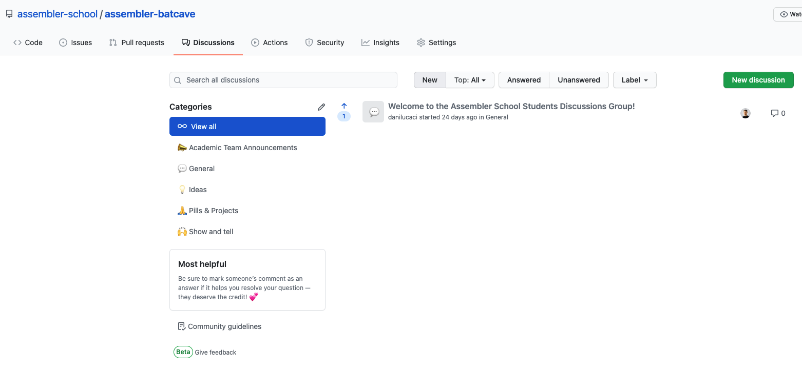
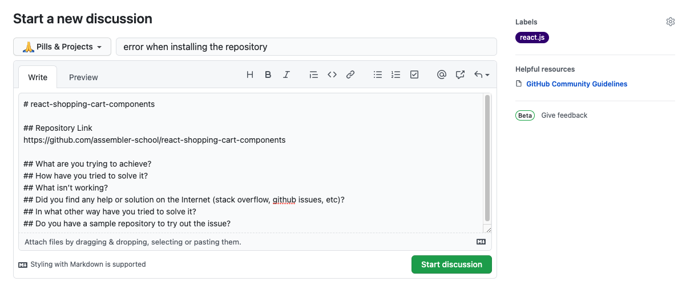
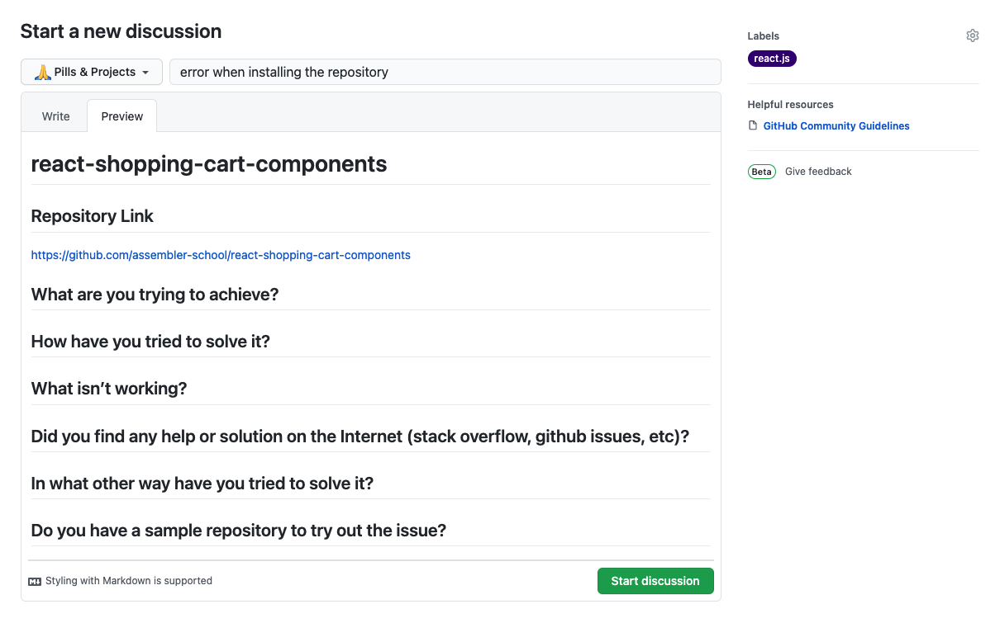

`#assembler-school` `#master-in-software-engineering`

# Assembler School Batcave

👋 `Welcome to the Assembler School discussions group aka`: The Assembler Batcave 🦇!

## Getting Started

In this repo you can talk and collaborate with your colleagues and the academic team about pills, projects and general topics related to the contents we teach and programming in general.

To get started press the `Discussions` tab in the Github UI.



There you will find the following categories:

## Academic Team Announcements

This is the category where the academic team will post questions and general announcements related to the program.

This is a category of type `Announcement`:

- Share updates and news with your community. Only maintainers and admins can post new discussions in these categories, but anyone can comment and reply.

## General

This is the category where both you as a student and the academic team will post questions and general announcements related to the program.

Here you can post anything related to programming in general.

This is a category of type `Open ended discussion`:

- Enable your community to have conversations that don't require a definitive answer to a question. Great for sharing tips and tricks or just chatting.

## Ideas

This is the category where both you as a student and the academic team can post new ideas that can be used as a pill or project, things that might be interesting to include in the program or anything related.

This is a category of type `Open ended discussion`:

- Enable your community to have conversations that don't require a definitive answer to a question. Great for sharing tips and tricks or just chatting.

## Pills & Projects

This is the category where you will have to post any question you have about the contents seen in the program. Any issue, question, doubt or feedback you have about the pills and projects in the program will have to be posted here.

This is a category of type `Question / Answer`:

- Enable your community to ask questions, suggest answers, and vote on the best suggested answer.

## Show and tell

This is the category where you can show off your projects both the ones created during the program as any personal ones that you made on your own.

- Please do not spam us. If you are posting a project that has affiliate links or that has any commercial gains it will be removed.

This is a category of type `Open ended discussion`:

- Enable your community to have conversations that don't require a definitive answer to a question. Great for sharing tips and tricks or just chatting.

## Key Points When Creating a New Issue or Question

⚠️ Before publishing a new issue or question you **MUST CAREFULLY READ** the following key points:

- [ ] Have you tried to solve this problem on your own first?
- [ ] Have you tried to solve this problem in a different way?
- [ ] Please try at least 2 different solutions to this problem before asking
  - You should always try to solve everything by yourself
- [ ] Have you asked your colleagues if they have faced the same problem?
- [ ] Is there an Issue asking the same question as yourself?
  - If not, you can create a new Issue with your question
  - If there is already an Issue with a question similar to yours then you should post your question there or any other info related to it
- [ ] If you haven’t been able to solve it by yourself or with your colleagues then you should ask for help by creating a new entry in the discussion.
- [ ] You must use the appropriate label to tag each issue

### Labels

- `concepts`: Conceptual issues
- `documentation`: Improvements or additions to documentation
- `help-wanted`: Issues that need help still
- `mongodb`: MongoDB issues
- `mysql`: MySQL issues
- `node.js`: Issues in node.js
- `php`: PHP Issues
- `projects`: Issues related to projects
- `react.js`: This issue or pull request already exists

**⚠️ Once the question/issue has been solved, please mark it as solved!**

## Details to include inside the Issue

Please include as much info about what you are trying to achieve and any helping documents or repositories with a testable solution.

- What are you trying to achieve?
- How have you tried to solve it?
- What isn’t working?
- Did you find any help or solution on the Internet (stack overflow, github issues, etc)?
- In what other way have you tried to solve it?
- Do you have a sample repository to try out the issue?

## New Pill / Project Entry Template



In `markdown`:

```markdown
# react-shopping-cart-components

## Repository Link

https://github.com/assembler-school/react-shopping-cart-components

## What are you trying to achieve?

## How have you tried to solve it?

## What isn’t working?

## Did you find any help or solution on the Internet (stack overflow, github issues, etc)?

## In what other way have you tried to solve it?

## Do you have a sample repository to try out the issue?
```

In `Preview`:



## Making an improvement suggestion or adding a new feature

If you would like to suggest an improvement to the repo, to add a new category, label or any new feature you will have to create a new Github Issue with the new feature.

### You must include the following:

- feature type: what would you like to suggest?
- why should we include this feature?
- how does it improve the discussions repository?
- is there anything similar already?
- how should it be included?
  - what do we need to do to include this feature/improvement
- example of the new feature/improvement
